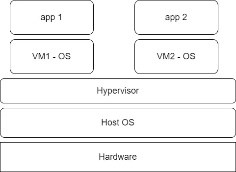

Virtual Machines
A virtual machine (VM) is another way of creating an isolated environment. A VM is effectively an individual computer that lives inside a host machine; multiple VMs can live inside a single host machine. VMs are created by virtualising the host machine’s underlying hardware (processing, memory and disk). The hardware is virtualised and split up, with a piece representing a portion of the underlying physical hardware, which a VM can be run on.

.